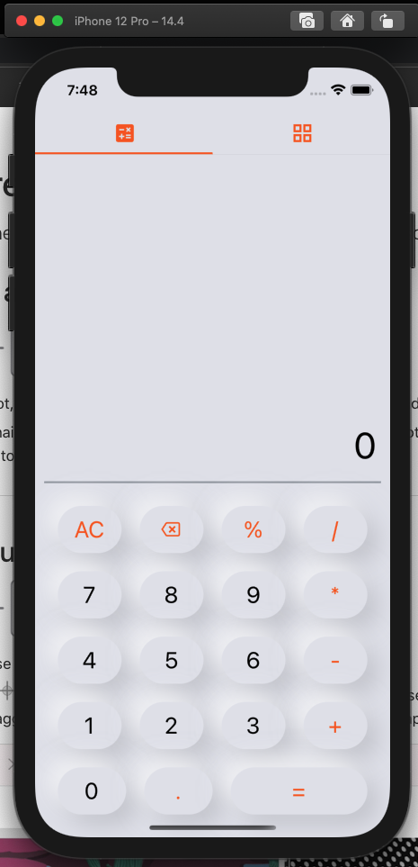
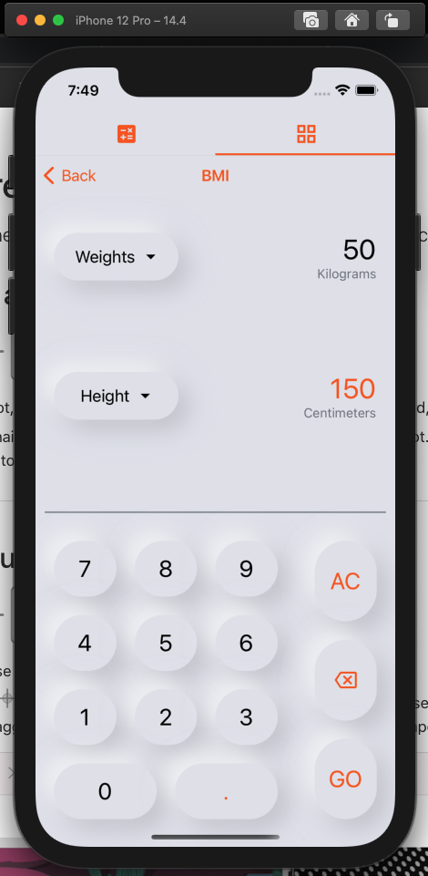
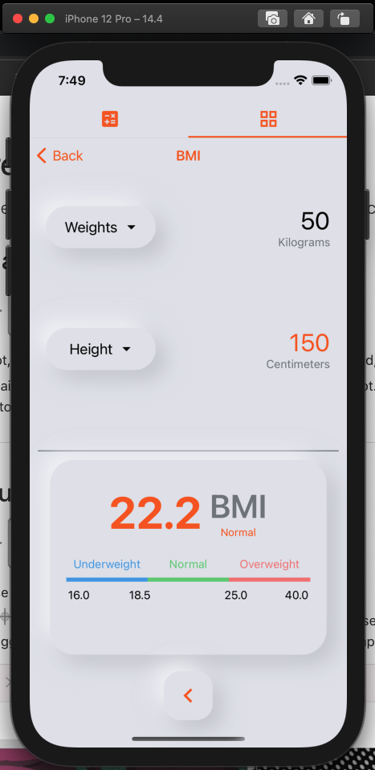
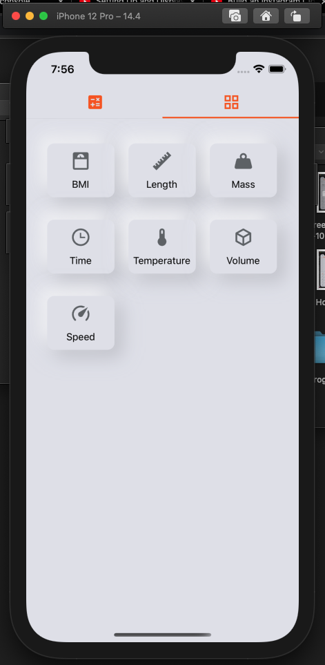
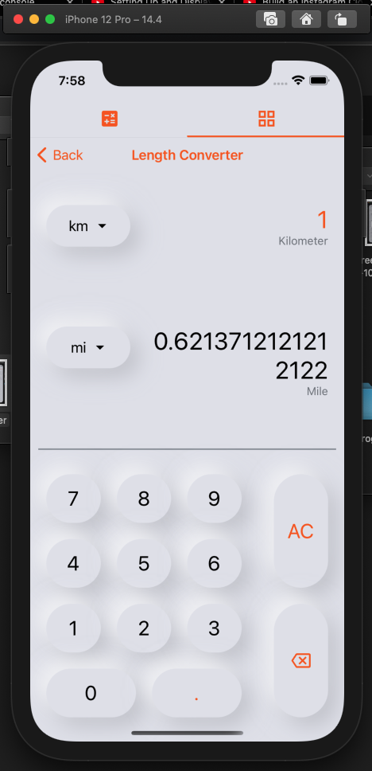
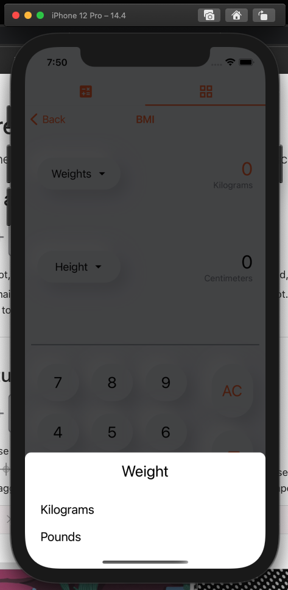

# React native neumorphic all in one calculator

Calculator apps inspired by the Xiaomi Calculator aps, with basic calculator, BMI calculator and Unit converter with neumorphic style for the button and card.








### How to use

If you want to try this apps, you need to install all the packaged needed by running these command on your terminal.

```bash
npm install
```

## Built with

- Javascript
- [React Native 0.66](https://reactnative.dev/)
- [React Navigation 6](https://reactnavigation.org/)
